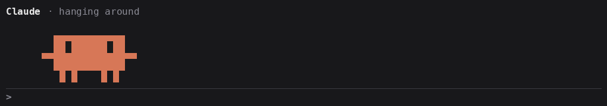
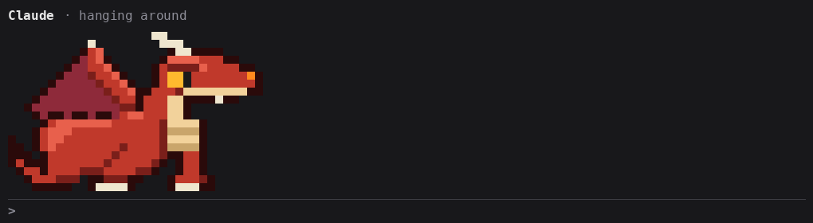
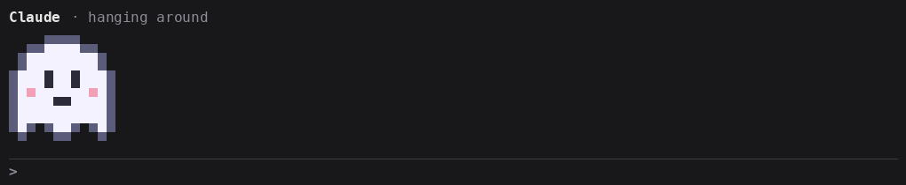
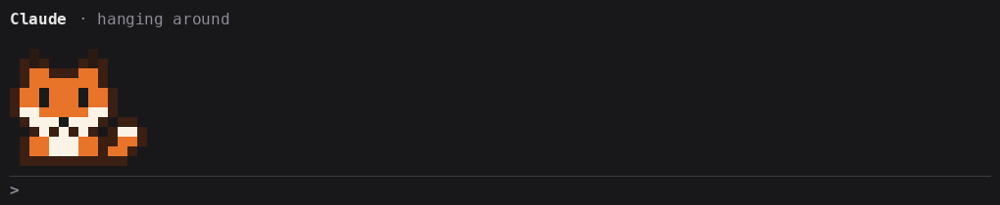
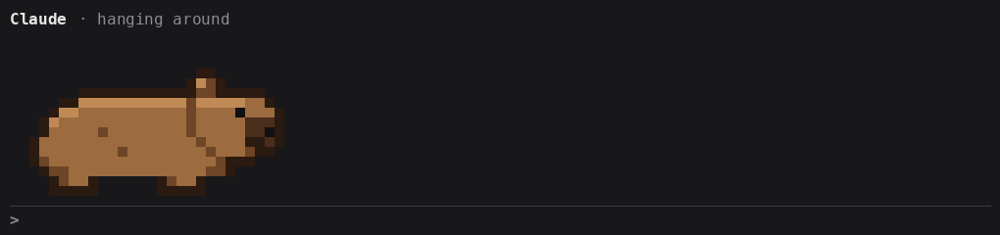
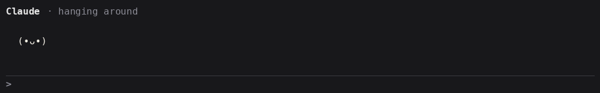
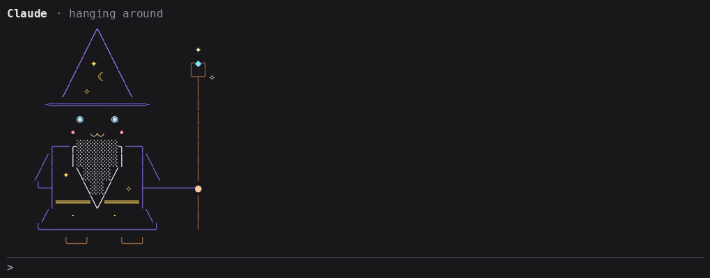
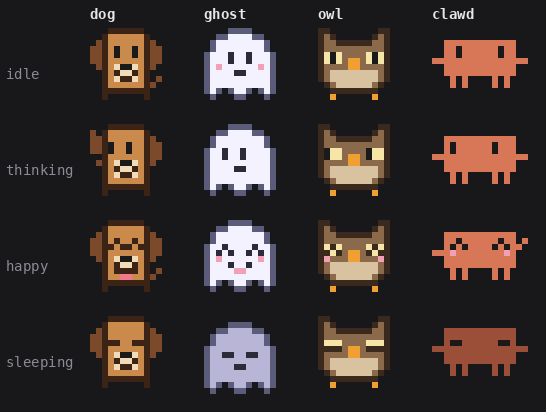

# pixel-pets

**English** · [Português](README.pt-BR.md)

A pixel-art pet that lives above your Claude Code prompt and reacts to what Claude is doing: it thinks, types while Claude runs commands, reads while Claude reads files, cheers when a turn ends and gets sad when a tool fails. Every subagent Claude starts gets a small pet of its own, in its own color, showing what that agent is doing right now.

Pets are plain JSON files, so you can draw your own or use one someone else made.















## What it shows

| Mood | When | Borrows from |
| --- | --- | --- |
| `sleeping` | no turn is running | (required) |
| `deepSleep` | nothing has happened for 10 minutes; from then on spells of 8 to 15 minutes, with a light sleep of 3 to 6 between them | sleeping |
| `idle` | awake with nothing to do, for a while after Claude finishes (see `awakeMinutes`) | thinking |
| `sleepy` | idle at night, from 22h to 6h | idle |
| `tired` | idle after 3 hours of work with no break of an hour | sleepy |
| `walking` | strolling around while idle and alone; a pack without it never walks | idle |
| `watching` | you are typing in the prompt while Claude is idle | reading |
| `waking` | for a moment when a prompt wakes it from a deep sleep | thinking |
| `thinking` | a turn started | sleeping |
| `typing` | any other tool, MCP tools included | thinking |
| `running` | `Bash` | typing |
| `writing` | `Edit`, `Write` | typing |
| `reading` | `Read` | thinking |
| `searching` | `Grep`, `Glob`, `WebFetch`, `WebSearch`, `LSP` | reading |
| `supervising` | Claude is waiting for its agents, or only thinking while they run, or they still run in the background after the turn | thinking |
| `compacting` | the conversation is being compacted | thinking |
| `sweating` | a turn has run for over 2 minutes and Claude is thinking or running a command | thinking |
| `worried` | idle after a few failures in a row | sweating |
| `grumpy` | idle after many failures in a row | sad |
| `proud` | idle after a streak of turns that went well | happy |
| `happy` | for two seconds after the last agent is done, now and then after a turn of work, or after you allow a permission prompt ("thanks!") | sleeping |
| `celebrating` | for four seconds after a turn of 5 minutes or more goes well, and on an anniversary | happy |
| `sad` | for two seconds after a tool fails, a turn errors, or you deny a permission prompt ("okay, I won't") | sleeping |

A pack only has to draw `sleeping`. Any mood it leaves out borrows the frames of its nearest drawn parent, so `running` falls back to `typing`, then `thinking`, then `sleeping`.

The pet walks a stage under Claude's line: it strolls while idle, and when subagents start it stays put and they gather around it, each on the side with more free room: on both sides when it stands in the middle, on one when it is in a corner. Each keeps its side until it leaves. When they do not fit where it stands, it walks aside to make room and they join as it gets there. Only a pack that draws `walking` walks. One that draws `main.teleport` instead gets about by vanishing and turning up elsewhere, as the slime and the ghost do; a pack with neither stays put at the left. Packs draw their pet facing right; pixel-pets mirrors it to face left, unless the pack says `"mirror": false`, as the kaomoji does: then it faces you whichever way it goes.

It keeps track of how the session goes. A failed tool or turn worries it and a turn that goes well makes it proud; a failed turn ends a streak of pride. Both fade a point every five minutes, and when it is idle the strongest feeling shows: grumpy, then worried, then tired, then proud, then sleepy at night. Worry and pride last for the session only; tiredness counts your work in every session, as a break is an hour with no prompt in any of them.

It has wants of its own too, for the session. Energy: sleep fills it and work drains it, and a pet low on energy dozes off sooner and rests longer between strolls. Boredom: it builds while nothing happens, and a bored pet gets up from a nap on its own for half a minute to a minute and a half, though never out of a deep sleep: it waits for that sleep to turn light, even hours in. Longing: it builds while you are away, and a pet that misses you strolls near the prompt and greets your first key after half an hour away ("missed you!"), unless a turn is running.

The time of day is your local time. At night it is sleepy and dozes off in half of `awakeMinutes`. It remembers you across sessions. The day's first sight of you opens with one welcome: an anniversary (a week, a month, 100 days, each year together), "missed you!" after two days or more away, or good morning. `/pet` also says how long you have been together. Late at night it says so once, whichever session sees you first. A `claude -p` run does not count as seeing you.

Now and then it says something of its own, in quotes on Claude's line: "hmm…" after 30 seconds of thinking with no tool, a remark on the 20th file read in a turn, on three agents at work at once, on a prompt at night, a sigh when boredom gets it up from a nap, and a word in its sleep now and then. Each at most once a turn, and never two within three minutes.

Each subagent gets a mini pet with its type (`Explore`, `Plan`, ...) and its current action. When the agent ends, its pet is happy (or sad, if it failed) for a moment and then leaves.

## Requirements

- Claude Code **2.1.287 or later**, where mods load by default. Built and tested on 2.1.291.
- A terminal for the pixel art. The Desktop app's Code tab shows a line of text instead, and the VS Code chat panel and `claude -p` draw nothing.

## Install

In a Claude Code session:

```
/plugin marketplace add HenriqueSchroeder/pixel-pets
/plugin install pixel-pets@pixel-pets
```

Or from your shell, then `/reload-plugins` in any open session:

```bash
claude plugin marketplace add HenriqueSchroeder/pixel-pets
claude plugin install pixel-pets@pixel-pets
```

`/pet` hides the pets and brings them back. `/pet <name>` gives the current project a pet of its own, so each of your Claude Code windows can tell which project it is in; it is kept for the project's next sessions too, and `/pet default` goes back to the one in your settings.

## Configure

Run `/plugin configure pixel-pets@pixel-pets`, or find **pixel-pets** in `/config`:

| Option | Default | What it does |
| --- | --- | --- |
| `pet` | `cat` | Which pet to show, picked from the shipped ones (see below), or `custom` for your own |
| `customPet` | | Your own pack when `pet` is `custom`: a file in `~/.claude/pets/`, without `.json` |
| `language` | `auto` | `auto` follows Claude Code's `language` setting, then `$LANG`. Or pick `en`, `pt-BR` |
| `awakeMinutes` | `1` | How long the pet stays awake, strolling around, after Claude finishes, before it falls asleep (half as long at night). `0` sends it straight to sleep |
| `labelLine` | `true` | Shows Claude's line above the pet: what it is doing, how long the turn has run and what the pet says. `false` leaves the pet and its agents alone, one row shorter |
| `agentLabels` | `true` | Shows each subagent's type and what it is doing under its mini pet. `false` leaves the mini pets alone, standing closer, told apart only by their color |

## Use another pet

1. Save the pack as `~/.claude/pets/<name>.json`. The file name must match the pack's `name`.
2. Pick `custom` in the `pet` option and set `customPet` to `<name>`.

A pack in `~/.claude/pets/` wins over a shipped one with the same name. If a pack can't be read, pixel-pets says why in a toast and shows the cat.

Shipped pets:

- [`cat`](pets/cat.json), the default, which turns side on to walk, and [`slime`](pets/slime.json), which bounces in place, melts into a puddle in a deep sleep and never walks: it sinks into the floor and wells up somewhere else.
- [`dog`](pets/dog.json), which wags its tail, pants, tilts its head when it thinks and turns side on to walk.
- [`ghost`](pets/ghost.json), which floats instead of walking, says boo now and then, fades as it sleeps and turns up elsewhere with a boo.
- [`owl`](pets/owl.json), which blinks slowly and turns its head all the way round.
- [`clawd`](pets/clawd.json), shown at the top with the dragon, the ghost, the fox and the capybara: the critter on Claude Code's welcome screen, waving its little arms, cheering with both when a long job is done and cracking a whip at its agents to keep them at it. Fan art: not made or endorsed by Anthropic.
- [`fox`](pets/fox.json), which sways its brush, pounces on mice under the snow and turns side on to walk.
- [`dragon`](pets/dragon.json), a big red dragon that breathes fire, counts its hoard and flies off to land elsewhere. It draws no mini pets.
- [`capybara`](pets/capybara.json), the calmest of them all: it chews grass, lets a bird sit on its head and balances an orange. It draws no mini pets.
- [`kaomoji`](pets/kaomoji.json), a little face drawn in text that hums as it strolls and never turns its back on you.
- [`wizard`](pets/wizard.json), a wizard drawn in text: instead of walking it vanishes in a swirl of sparkles and turns up elsewhere. It brews potions, juggles orbs, plays with its bat and zaps the sky with its staff, startling its agents, who are little apprentices.



## Draw your own

A pack is a palette and some frames. Each frame is rows of palette letters, and `.` is see-through:

```json
{
  "$schema": "https://raw.githubusercontent.com/HenriqueSchroeder/pixel-pets/main/schema/pet.schema.json",
  "name": "blob",
  "palette": { "o": "#1a1a1a", "b": "#7cc4f2", "e": "#ffffff" },
  "main": {
    "moods": {
      "sleeping": [
        ["..oooo..", ".obbbbo.", "obbbbbbo", "obobbobo", "obbbbbbo", ".oooooo."]
      ]
    }
  },
  "mini": { "moods": { "working": [[".oo.", "obbo", ".oo."]] } }
}
```

- Only `sleeping` is required. A mood you leave out borrows from its parent, as the table in [What it shows](#what-it-shows) lists.
- Give a mood several frames and they play in a loop at `fps` frames per second (1–12, default 4). Repeat a frame to hold a pose: at 4 fps, the same frame four times in a row holds it for a second.
- Every frame of the main pet has the same size, up to 48×32 pixels. The mini pet goes up to 12×12.
- Two pixel rows fit in one terminal row, so a 12×12 pet takes 12 columns and 6 rows.
- The mini pet needs `working`. Its `happy` and `sad`, shown when an agent ends, and `startled`, shown while an action that `startles` plays, fall back to `working`.
- `mini.tint` (default `b`) is the letter recolored for each subagent.
- `"mini": false` draws no mini pets: while agents work, the pet shows them only by its own `supervising`. Handy for a wide pet that leaves little room beside it.
- See every mood of a pack, and what it borrows, in your terminal: `npx tsx scripts/preview-pet.ts <name or path>`.
- `"mirror": false` keeps the pet from flipping when it heads left, for art that looks wrong mirrored, such as letters or a logo.

### Draw it in text

Say `"style": "ascii"` and a frame is rows of text instead: each character takes one terminal cell, and a space is see-through. `ink` is the color of the text:

```json
{
  "name": "face",
  "style": "ascii",
  "ink": "#f0ece2",
  "palette": { "y": "#ffd23f" },
  "main": {
    "moods": {
      "sleeping": [["      z", "  (-ᴗ-)"], ["     zZ", "  (-ᴗ-)"]],
      "proud": [{ "art": ["      ✧", "  (≖ᴗ≖)"], "color": ["......y", "......."] }]
    }
  },
  "mini": { "moods": { "working": [["(•_•)"]] } }
}
```

- To color some characters, give the frame as `{ "art": [...], "color": [...] }`: `color` has the same rows and widths as `art`, each character a palette letter, or `.` for the ink. The palette is optional when everything is in ink.
- A text row is a whole terminal row, so the pet goes up to 48 columns by 16 rows, and the mini pet up to 12 by 6.
- Use characters that take one cell: no emoji, CJK or fullwidth letters, which the pack refuses. Some symbols, such as `•` and `°`, take two cells in East Asian terminals.
- `mini.tint` defaults to `.`, the ink, so a mini pet drawn all in ink takes its agent's color whole.
- When it mirrors, pixel-pets swaps the characters that point one way, `(` for `)`, `/` for `\`, `<` for `>` and the like. A face that still looks wrong flipped wants `"mirror": false`.

### Make it feel alive

A loop alone looks like a machine. Four optional keys under `main` make the pet unpredictable:

```json
"variants": {
  "thinking": [[["...frame..."], ["...frame..."]]]
},
"transitions": {
  "*>sleeping": [["...yawn..."], ["...eyes droop..."]],
  "sleeping>*": [["...stretch..."]]
},
"actions": {
  "blink": { "frames": [["...eyes shut..."]], "moods": ["thinking", "reading"], "every": [2, 6] }
},
"activities": {
  "yarn": {
    "start": [["...a ball rolls in..."]], "loop": [["...push..."], ["...roll..."]], "end": [["...bat it away..."]],
    "seconds": [15, 40], "moods": ["idle"], "every": [60, 150],
    "label": { "en": "playing with yarn", "pt-BR": "brincando com o novelo" }
  }
}
```

- `variants`: more loops for a mood you draw in `moods`. One of them, or the mood's own loop, is picked at random each time the mood starts.
- `transitions`: frames played once when the mood changes, keyed `from>to`. Either side may be `*`. An exact key wins over `from>*`, which wins over `*>to`.
- `actions`: frames played once at a random moment while the pet is in one of `moods`, `every` [min, max] seconds after the last time. Blinks, ear twitches and yawns live here, so the loops can stay calm. An action with `startles`, a frame counted from 0, makes the agents' mini pets on the side the pet faces play `startled` from that frame until it ends, always from its first frame: clawd's whip crack.
- `activities`: longer plays, timed like an action, in `idle` or a mood that stands in for it (`proud`, `sleepy`, `tired`, `worried`, `grumpy`). `start` plays once, `loop` repeats in whole loops for `seconds` [min, max], then `end` plays once; `start` and `end` are optional. While it plays, `label` (by language code, one line of up to 40 characters) takes the place of the status words, and the pet neither naps nor strolls off. Any other mood cuts it short, its `end` unplayed. Up from a nap, the pet soon starts one. Every shipped pet has a few: the cat chases a butterfly, the capybara soaks in a hot spring, the dragon counts its hoard. Up to 8; an activity cannot share a name with an action.
- An action is a whole frame, so keep its face the same as the moods it plays in. The cat has one blink per expression for that reason.
- A mood holds up to 16 frames; at 4 fps that is 4 seconds.

Give it a voice with `speech`, at the top level: lines by language code and situation, one picked at random. A language or situation you leave out says the default line.

```json
"speech": {
  "en": { "longThink": ["mrrp… hmm"], "manyReads": ["so many files… mrow!"] },
  "pt-BR": { "longThink": ["mrrp… hmm"] }
}
```

The situations are `longThink`, `manyReads`, `manyAgents`, `lateNight`, `bored` and `dreaming`. Up to 8 lines each, one line of up to 40 characters.

A pet that does not walk can teleport: give `main` a `teleport` with `vanish`, played where it stands, and `appear`, played where it lands, frames like any other. It is how it strolls and how it makes room for agents.

Give it a nature with `personality`, at the root of the pack: three traits from 0 to 1, each the usual 0.5 when left out. `energetic` tires slower, `curious` gets bored and up from a nap sooner (0 never does), `affectionate` misses you sooner (0 never does). The dog is `{ "energetic": 0.8, "curious": 0.6, "affectionate": 0.9 }`; the slime, lazy, is `{ "energetic": 0.2, "curious": 0.3, "affectionate": 0.6 }`.

The [schema](schema/pet.schema.json) gives your editor completion and checks. To share a pet, see [CONTRIBUTING.md](CONTRIBUTING.md).

## Check what it does before you install

A mod runs with your permissions. Clone this repository and list every event it hooks and every call it makes:

```bash
claude plugin validate ./pixel-pets
```

pixel-pets reads your pet packs, Claude Code's `language` setting and the `HOME` and `LANG` variables, and draws above the prompt. It never writes files, runs commands, or uses the network.

## Limitations

- The pixel art needs a terminal. Other surfaces get a line of text.
- A pet pack is read when the plugin loads. After editing one, run `/reload-plugins`.
- The mods API is in early access and can change between Claude Code releases.

## Development

```bash
claude --plugin-dir .            # try it in a session
claude plugin validate .         # manifest, hooks and calls
claude plugin test .             # tests/
npx tsx scripts/check-pets.ts    # every pack in pets/
npx tsc -p .                     # types (after one --plugin-dir run lays them)
```

## License

[MIT](LICENSE)
