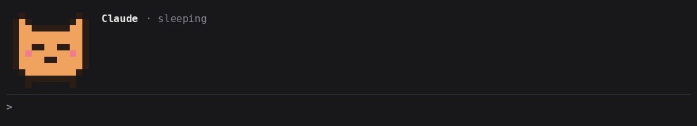
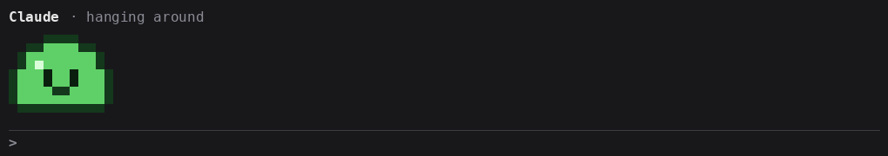

# pixel-pets

[English](README.md) · **Português**

Um pet em pixel art que vive acima do prompt do Claude Code e reage ao que o Claude está fazendo: pensa, digita enquanto o Claude roda comandos, lê enquanto o Claude lê arquivos, comemora quando um turno termina e fica triste quando uma tool falha. Cada subagent que o Claude inicia ganha um pet pequeno, com cor própria, mostrando o que aquele agent está fazendo agora.

Os pets são arquivos JSON, então você pode desenhar o seu ou usar um que outra pessoa fez.





## O que ele mostra

| Humor | Quando | Herda de |
| --- | --- | --- |
| `sleeping` | nenhum turno rodando | (obrigatório) |
| `deepSleep` | nada aconteceu por 10 minutos | sleeping |
| `idle` | acordado sem nada para fazer, por um tempo depois que o Claude termina (veja `awakeMinutes`) | thinking |
| `walking` | passeando quando está à toa e sozinho; um pack sem ele nunca anda | idle |
| `watching` | você está digitando no prompt enquanto o Claude está parado | reading |
| `waking` | por um instante, quando um prompt o acorda de um sono profundo | thinking |
| `thinking` | um turno começou | sleeping |
| `typing` | qualquer outra tool, incluindo as de MCP | thinking |
| `running` | `Bash` | typing |
| `writing` | `Edit`, `Write` | typing |
| `reading` | `Read` | thinking |
| `searching` | `Grep`, `Glob`, `WebFetch`, `WebSearch`, `LSP` | reading |
| `waiting` | o Claude está esperando você responder um pedido de permissão | thinking |
| `supervising` | o Claude está esperando os agents, ou eles ainda rodam em background depois do turno | thinking |
| `compacting` | a conversa está sendo compactada | thinking |
| `sweating` | o turno passou de 2 minutos e o Claude está pensando ou rodando um comando | thinking |
| `happy` | por dois segundos depois que um turno termina | sleeping |
| `sad` | por dois segundos depois que uma tool falha ou um turno dá erro | sleeping |

Um pack só precisa desenhar `sleeping`. Todo humor que faltar usa os quadros do pai desenhado mais próximo: `running` cai em `typing`, depois `thinking`, depois `sleeping`.

O pet anda num palco embaixo da linha do Claude: passeia quando está à toa e, quando subagents começam, fica parado e eles se juntam em volta dele, cada um do lado com mais espaço livre: dos dois lados quando ele está no meio, de um só quando está num canto. Cada um fica do seu lado até sair. Só anda o pack que desenha `walking`: sem ele, o pet fica parado à esquerda, como o slime. Os packs desenham o pet virado para a direita; o pixel-pets espelha para ele andar para a esquerda.

Cada subagent ganha um mini pet com o tipo dele (`Explore`, `Plan`, ...) e a ação atual. Quando o agent termina, o pet fica feliz (ou triste, se falhou) por um instante e sai.

## Requisitos

- Claude Code **2.1.287 ou mais novo**, em que mods carregam por padrão. Feito e testado no 2.1.291.
- Um terminal para o pixel art. A aba Code do app Desktop mostra uma linha de texto no lugar, e o chat do VS Code e o `claude -p` não desenham nada.

## Instalação

Numa sessão do Claude Code:

```
/plugin marketplace add HenriqueSchroeder/pixel-pets
/plugin install pixel-pets@pixel-pets
```

Ou pelo shell, depois `/reload-plugins` nas sessões abertas:

```bash
claude plugin marketplace add HenriqueSchroeder/pixel-pets
claude plugin install pixel-pets@pixel-pets
```

`/pet` esconde os pets e traz de volta.

## Configuração

Rode `/plugin configure pixel-pets@pixel-pets`, ou procure **pixel-pets** no `/config`:

| Opção | Padrão | O que faz |
| --- | --- | --- |
| `pet` | `cat` | Qual pet mostrar: um pack em `~/.claude/pets/` ou um que vem em [`pets/`](pets/) |
| `language` | `auto` | `auto` segue o setting `language` do Claude Code, depois o `$LANG`. Ou escolha `en`, `pt-BR` |
| `awakeMinutes` | `1` | Quanto tempo o pet fica acordado, passeando, depois que o Claude termina, antes de dormir. `0` manda direto dormir |

## Usar outro pet

1. Salve o pack em `~/.claude/pets/<nome>.json`. O nome do arquivo precisa ser igual ao `name` do pack.
2. Coloque `<nome>` na opção `pet`.

Um pack em `~/.claude/pets/` ganha de um embutido com o mesmo nome. Se um pack não puder ser lido, o pixel-pets diz o motivo num toast e mostra o gato.

Pets que vêm junto, os dois mostrados no topo: [`cat`](pets/cat.json), o padrão, e [`slime`](pets/slime.json), que quica no lugar, derrete numa poça no sono profundo e nunca anda.

## Desenhe o seu

Um pack é uma paleta e alguns quadros. Cada quadro são linhas de letras da paleta, e `.` é transparente. O formato completo, com exemplo, está no [README em inglês](README.md#draw-your-own) e no [schema](schema/pet.schema.json), que dá autocomplete e validação no editor.

- Só `sleeping` é obrigatório. Um humor que faltar herda do pai, como a tabela em [O que ele mostra](#o-que-ele-mostra) lista.
- Um humor com vários quadros toca em loop a `fps` quadros por segundo (1–12, padrão 4). Repita um quadro para segurar a pose: a 4 fps, o mesmo quadro quatro vezes seguidas segura por um segundo.
- Todos os quadros do pet principal têm o mesmo tamanho, até 24×24 pixels. O mini pet vai até 12×12.
- Duas linhas de pixel cabem numa linha do terminal, então um pet de 12×12 ocupa 12 colunas e 6 linhas.
- O mini pet precisa de `working`. O `happy` e o `sad` dele, mostrados quando um agent termina, caem em `working`.
- `mini.tint` (padrão `b`) é a letra recolorida para cada subagent.
- Veja todos os humores de um pack, e de quem cada um herda, no seu terminal: `npx tsx scripts/preview-pet.ts <nome ou caminho>`.

### Dê vida ao pet

Só um loop parece máquina. Três chaves opcionais em `main` deixam o pet imprevisível (o formato está no [README em inglês](README.md#make-it-feel-alive)):

- `variants`: mais loops para um humor que você desenha em `moods`. Um deles, ou o loop do próprio humor, é sorteado cada vez que o humor começa.
- `transitions`: quadros tocados uma vez quando o humor muda, com chave `de>para`. Um dos lados pode ser `*`. A chave exata ganha de `de>*`, que ganha de `*>para`.
- `actions`: quadros tocados uma vez num momento aleatório enquanto o pet está num dos `moods`, `every` [mín, máx] segundos depois da última vez. Piscadas, orelhas mexendo e bocejos ficam aqui, e os loops podem ficar calmos.
- Uma ação é um quadro inteiro, então mantenha a mesma cara dos humores em que ela toca. Por isso o gato tem uma piscada para cada expressão.
- Um humor tem até 16 quadros; a 4 fps, são 4 segundos.

Para compartilhar um pet, veja o [CONTRIBUTING.md](CONTRIBUTING.md).

## Confira o que ele faz antes de instalar

Um mod roda com as suas permissões. Clone o repositório e liste todo evento que ele usa e toda chamada que ele faz:

```bash
claude plugin validate ./pixel-pets
```

O pixel-pets lê os seus packs de pet, o setting `language` do Claude Code e as variáveis `HOME` e `LANG`, e desenha acima do prompt. Ele nunca escreve arquivos, roda comandos ou usa a rede.

## Limitações

- O pixel art precisa de um terminal. As outras superfícies recebem uma linha de texto.
- O pack é lido quando o plugin carrega. Depois de editar um, rode `/reload-plugins`.
- A API de mods está em early access e pode mudar entre versões do Claude Code.

## Licença

[MIT](LICENSE)
